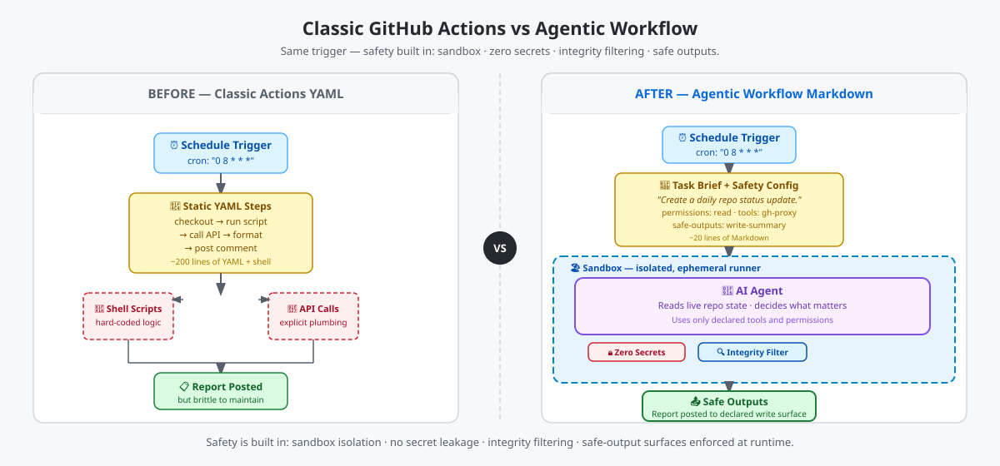

<!-- page-journey: all -->
<!-- page-adventure: core -->
<!-- learning:false -->

# Welcome to our Agent Factory Tour

By the end of this workshop, a real AI agent will create an issue with a summary of the activity in your repository over the latest 24h, every day, without you writing shell-script workflow code.

You'll build a **[GitHub Agentic Workflow](https://github.github.com/gh-aw/introduction/overview/)**:
> A GitHub Action that uses AI to inspect your repository, decide what matters, and publish a useful status report on a schedule — practical enough to adapt for real teams.

The diagram below shows how an agentic workflow compares to a classic Actions YAML approach — same trigger, far less code, safety built in.

<picture>
   <source media="(prefers-color-scheme: dark)" srcset="images/00-actions-vs-agentic-dark.svg">
   <source media="(prefers-color-scheme: light)" srcset="images/00-actions-vs-agentic-light.svg">
   
</picture>

Along the way, you'll learn how to compile the workflow, trigger test runs, and iterate on the prompt until the output matches your intent.

Excited to get started? Let's gooo! 🚀

<!-- journey: all -->
**Next:** [What You Need Before We Start](01-prerequisites.md)
<!-- /journey -->
