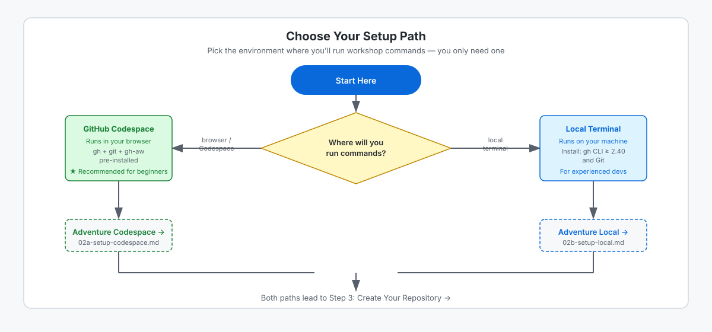

<!-- page-journey: all -->
<!-- page-adventure: core -->
<!-- learning:false -->

# Before we start

## 🎯 What You'll Do

In this step, you confirm your account and tool prerequisites, then choose your setup path. After this, you continue directly to the matching setup instructions instead of doing setup work here.

## Confirm account access

Sign in at [github.com](https://github.com). If you do not have an account yet, use the **Sign up** option there first.

## Choose your development environment

| Path | Best for | What you need |
|---|---|---|
| **Codespace** | Most learners — no local installs needed | A GitHub account with Codespaces access |
| **Local terminal** | Developers with an existing terminal setup | Git and the `gh` CLI installed locally |
| **Browser (no terminal)** | Desktop or laptop learners using GitHub Copilot without a terminal | A GitHub account and a desktop browser |

If you are unsure, start with a Codespace. It gives you a ready-to-use environment hosted in the cloud.

If you are **familiar with terminals**, use your usual local setup. We will go over the requirements.

If you are using a **desktop or laptop without a terminal** — for example, a shared computer — or you plan to use the GitHub Copilot (CCA/Agents tab), choose the **browser path**. No installation or terminal is required. You will create your repository on github.com and author workflows directly from the Agents tab in your browser.

> [!IMPORTANT]
> Phones and tablets are not supported for this workshop. Switch to a desktop or laptop before continuing.

<picture>
   <source media="(prefers-color-scheme: dark)" srcset="images/01-setup-path-decision-dark.svg">
   <source media="(prefers-color-scheme: light)" srcset="images/01-setup-path-decision-light.svg">
   
</picture>

## Verify AI engine access

Open [github.com/settings/copilot](https://github.com/settings/copilot) and confirm both show:

- **Copilot CLI is enabled**
- Some **Models are available**

This workshop uses GitHub Copilot, so you can continue without configuring external provider API keys.

> [!TIP]
> Agentic Workflows supports multiple agent and model providers (for example, Anthropic Claude Code, OpenAI Codex, and Google Gemini), but this workshop uses GitHub Copilot end-to-end so you can focus on workflow concepts.

<!-- journey: codespace -->
**Next:** Open [Set Up a Codespace](02a-setup-codespace.md).
<!-- /journey -->
<!-- journey: local -->
**Next:** Open [Set Up Your Local Terminal](02b-setup-local.md).
<!-- /journey -->
<!-- journey: ui,copilot -->
**Next:** Open [Set Up Without a Terminal](02c-setup-browser.md).
<!-- /journey -->
