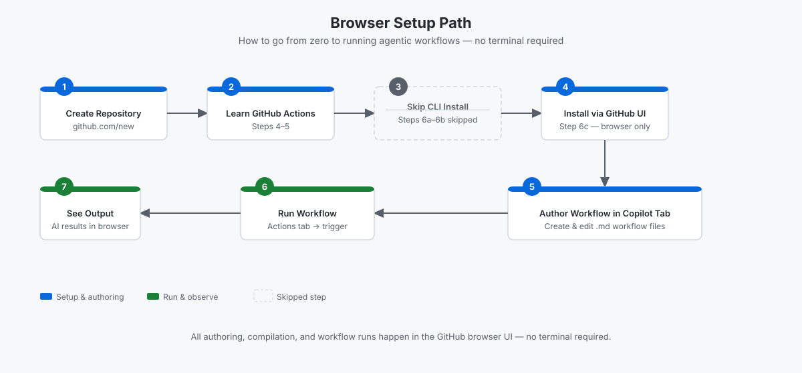

<!-- page-journey: ui -->
<!-- page-adventure: setup -->
# Set Up Without a Terminal

## 🎯 What You'll Do

You'll create your practice repository on github.com. No terminal, no local installs, and no Codespace required — everything in this workshop runs in your browser.

The diagram below shows the seven steps of your path, with the CLI install stage automatically skipped:

<picture>
   <source media="(prefers-color-scheme: dark)" srcset="images/02c-browser-setup-flow-dark.svg">
   <source media="(prefers-color-scheme: light)" srcset="images/02c-browser-setup-flow-light.svg">
   
</picture>

## Steps

**Verify you are on the right path before continuing:**

- [ ] You are on a desktop or laptop without a terminal
- [ ] You plan to author and run workflows from the GitHub Copilot or Agents tab in your browser

> [!IMPORTANT]
> Phones and tablets are not supported for this workshop. Switch to a desktop or laptop before continuing.

If you have access to a terminal, consider one of the other setup paths instead.

> [!TIP]
> The [Codespace path](02a-setup-codespace.md) gives you an in-browser terminal with all tools pre-installed. The [local terminal path](02b-setup-local.md) uses your own machine. Either one works for the full workshop.

### Create your repository

1. Go to [github.com/new](https://github.com/new).
2. Set the owner to yourself.
3. Name the repository `my-agentic-workflows`.
4. Set visibility to **Private**.
5. Check **Add a README file**.
6. Click **Create repository**.

You now have a practice repository. Keep this tab open — you will use it throughout the workshop.

> [!NOTE]
> The browser path skips the `gh` CLI installation (Steps 6a–6b). When the workshop reaches [Install the gh-aw CLI Extension](06-install-gh-aw.md), your path automatically continues to [No Installation Needed — GitHub UI Path](06c-install-ui.md).

## ✅ Checkpoint

- [ ] Your `my-agentic-workflows` repository exists on github.com
- [ ] You are signed in to GitHub in your browser
- [ ] You are ready to continue without a terminal

<!-- journey: ui -->
**Next:** [GitHub Actions Intro](04-github-actions-intro.md)
<!-- /journey -->
