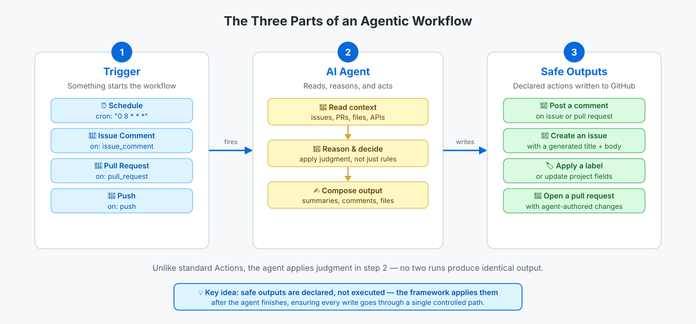

<!-- page-journey: all -->
<!-- page-adventure: core -->
# Practice: Recognize Agentic Workflows

## 📋 Before You Start

- You've read [What Are Agentic Workflows?](05-agentic-workflows-intro.md)

These exercises help you apply what you just learned — deciding when to use an agentic workflow and drafting your first task brief.

## Try it: agentic or standard?

For each task below, decide whether it calls for an **agentic workflow** or a **standard Actions workflow**, then reveal the answer.

**Task A:** Run lint and unit tests on every pull request, fail if any check exits non-zero.

- [ ] I've made my decision for Task A

<details>
<summary>Reveal Task A answer</summary>

**Standard Actions workflow.** Every run follows the same fixed steps: run lint, run tests, report the exit code. No judgment is required.

</details>

**Task B:** Each morning, read all open issues, decide which ones look most urgent, and post a short triage summary.

- [ ] I've made my decision for Task B

<details>
<summary>Reveal Task B answer</summary>

**Agentic workflow.** The agent reads live issue data, applies judgment to assess urgency, and composes a summary that differs every run based on what it finds.

</details>

> [!TIP]
> Want to go deeper? [Side Quest: Agentic Workflows Deep Dive](side-quest-05-02-aw-deep-dive.md) covers more exercises, example output, the two-file structure, and concept checks.

## Try it: write a one-sentence task brief

Pick any routine task you do today that involves reading some data and writing a summary — a daily standup note, a weekly inbox digest, or a triage of support tickets. Write a one-sentence task brief for an agent to do it automatically.

Your brief should answer: *what data should the agent read, and what should it post when it's done?*

Example:

```
Each Monday morning, read all pull requests opened in the past week,
identify the three with the most review comments, and post a summary
as an issue with the title "Weekly PR Digest".
```

- [ ] I've drafted a one-sentence task brief for a real routine task
- [ ] My brief specifies what data the agent should read
- [ ] My brief specifies what the agent should post when done

> [!TIP]
> Struggling to think of a task? Browse the [gh-aw issue-ops pattern](https://github.github.com/gh-aw/patterns/issue-ops/) for inspiration. You will write a real version of your brief in Step 7.

## ✅ Checkpoint

The three parts work together like this: a trigger fires the workflow, the agent reads context and applies judgment, and safe outputs write the result back to GitHub.

<picture>
  <source media="(prefers-color-scheme: dark)" srcset="images/05c-trigger-agent-output-dark.svg">
  <source media="(prefers-color-scheme: light)" srcset="images/05c-trigger-agent-output-light.svg">
  
</picture>

- [ ] I can decide whether a task calls for an agentic or a standard Actions workflow
- [ ] I have drafted a one-sentence task brief that specifies what data to read and what to post
- [ ] I can describe the three parts of an agentic workflow: trigger → agent → safe output

<!-- journey: all -->
**Next:** [Install the gh-aw CLI Extension](06-install-gh-aw.md)
<!-- /journey -->
