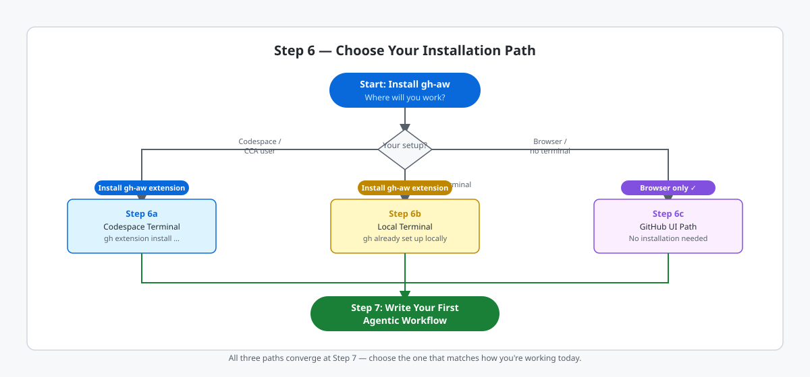

<!-- page-journey: all -->
<!-- page-adventure: core -->
<!-- learning:false -->
# Install the gh-aw CLI Extension

`gh-aw` is the CLI extension that compiles your [agentic workflow](https://github.github.com/gh-aw/introduction/overview/) Markdown files and triggers runs from your terminal. If you're on the GitHub UI path, no local installation is needed: an agent compiles the workflow, and GitHub Actions executes the committed [lock file](https://github.github.com/gh-aw/reference/glossary/#workflow-lock-file-lockyml).

## 📋 Before You Start

- You have completed [Agentic Workflows Intro](05-agentic-workflows-intro.md)
- Your development environment is ready (Codespace, local terminal, or browser path)

## Choose Your Path

The diagram below shows how the three paths diverge and then rejoin at Step 7.

<picture>
   <source media="(prefers-color-scheme: dark)" srcset="images/06-install-path-decision-dark.svg">
   <source media="(prefers-color-scheme: light)" srcset="images/06-install-path-decision-light.svg">
   
</picture>

<!-- journey: codespace -->
**Next:** [Install gh-aw — Codespace Terminal](06a-install-terminal.md)
<!-- /journey -->
<!-- journey: local,terminal -->
**Next:** [Install gh-aw — Local Terminal](06b-install-local.md)
<!-- /journey -->
<!-- journey: ui,copilot -->
**Next:** [No Installation Needed — GitHub UI Path](06c-install-ui.md)
<!-- /journey -->
