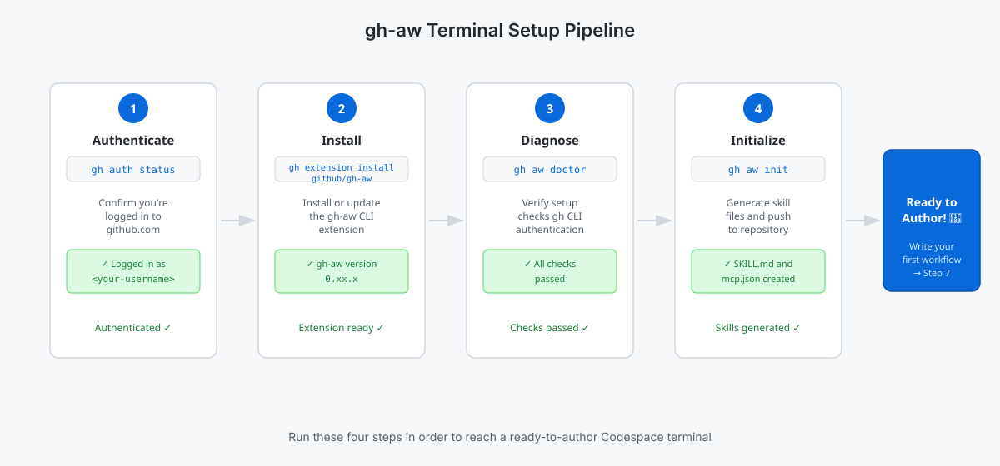

<!-- page-journey: codespace -->
<!-- page-adventure: setup -->
<!-- learning:false -->
# Install gh-aw — Codespace Terminal

> [!NOTE]
> Using a local terminal instead? Switch to [Install gh-aw — Local Terminal](06b-install-local.md).

## 🎯 What You'll Do

You'll verify the `gh` CLI is authenticated, install the `gh-aw` extension, and run one quick diagnostic to confirm your Codespace terminal is ready for [agentic workflow](https://github.github.com/gh-aw/introduction/overview/) setup.

## 📋 Before You Start

- You've completed [What Are Agentic Workflows?](05-agentic-workflows-intro.md)
- You have a Codespace terminal open (from [Set Up a Codespace](02a-setup-codespace.md))

Run this to confirm `gh` is authenticated before continuing:

```bash
gh auth status
```

Expected output: `Logged in to github.com as <your-username>`. If you see an error, return to [Verify your Codespace is ready](02a-setup-codespace.md#verify-your-codespace-is-ready).

The four steps below take you from an empty Codespace to a fully initialized authoring environment.

<picture>
   <source media="(prefers-color-scheme: dark)" srcset="images/06a-setup-pipeline-dark.svg">
   <source media="(prefers-color-scheme: light)" srcset="images/06a-setup-pipeline-light.svg">
   
</picture>

## Install from terminal

Check whether `gh-aw` is already installed, then install or update accordingly:

```bash
gh aw --version
```

- **Version shown?** Update the extension: `gh extension upgrade github/gh-aw`
- **Command not found?** Install the extension:

```bash
gh extension install github/gh-aw
gh aw --version
```

You should see output like `gh-aw version 0.81.6`.

### Troubleshooting: 403 Forbidden on install

Your org token may not allow public extension installs. Use the fallback installer:

```bash
curl -sL https://raw.githubusercontent.com/github/gh-aw/main/install-gh-aw.sh | bash
```

Need more help? See [Side Quest: Install gh-aw Troubleshooting](side-quest-06-01-install-troubleshooting.md).

## Run a quick diagnostic

```bash
gh aw doctor
```

This verifies your GitHub CLI authentication using the same setup checks `gh-aw` expects before later authoring and compile steps.

Expected result: a success message confirming GitHub CLI authentication. If it fails, use [Side Quest: Install gh-aw Troubleshooting](side-quest-06-01-install-troubleshooting.md), then rerun `gh aw doctor`.

## Initialize [agentic workflow](https://github.github.com/gh-aw/introduction/overview/) skills

Before you author your first workflow, initialize and push the generated skill files:

```bash
gh aw init
git add .
git commit -m "Initialize agentic workflow skills"
git push
```

This creates several files needed for agentic workflow authoring:
`.github/skills/agentic-workflows/SKILL.md`,
`.github/skills/agentic-workflow-designer/SKILL.md`,
`.github/agents/agentic-workflows.md`, `.github/mcp.json`,
`.github/workflows/copilot-setup-steps.yml`, and `.vscode/settings.json`.

## 🏃 Try It

Run `gh aw --help` and scan the list of sub-commands.

Which one sub-command do you expect to use in Step 7 when you create and run your first workflow?

## ✅ Checkpoint

- [ ] `gh auth status` shows you are logged in to github.com
- [ ] `gh aw --version` returns a version number
- [ ] `gh aw doctor` completes successfully
- [ ] `gh aw init` has been run in your practice repository
- [ ] All files generated by `gh aw init` are committed and pushed
- [ ] You can name one `gh aw` sub-command from `gh aw --help`

Want to understand how Copilot authenticates with your workflow?
➡️ **[Side Quest: Configure GitHub Copilot for Agentic Workflows](side-quest-06-03-copilot-token.md)**

<!-- journey: codespace -->
**Next:** [Write Your First Agentic Workflow — Terminal Path](07a-your-first-workflow-terminal.md)
<!-- /journey -->

