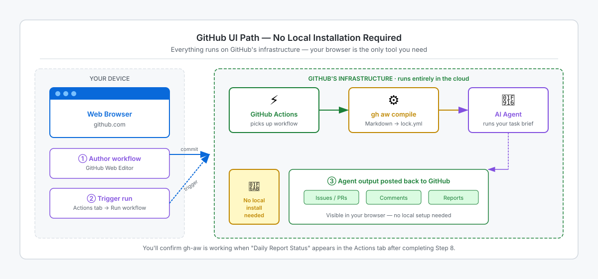

<!-- page-journey: ui -->
<!-- page-adventure: setup -->
<!-- learning:false -->
# No Installation Needed — GitHub UI Path

## 🎯 What You'll Do

You'll use GitHub Copilot to initialize your repository for GitHub Agentic Workflows, review the pull request it opens, and continue to workflow authoring with no local installation required.

If you decide you want a terminal after all, switch to [Install gh-aw — Codespace Terminal](06a-install-terminal.md) or [Install gh-aw — Local Terminal](06b-install-local.md).

## How this path works

On the GitHub UI path, you do not install `gh-aw` locally. You stay on github.com, ask GitHub Copilot to initialize the repository for agentic workflows, and let GitHub-hosted automation handle compilation and execution.

<picture>
   <source media="(prefers-color-scheme: dark)" srcset="images/06c-github-hosted-execution-dark.svg">
   <source media="(prefers-color-scheme: light)" srcset="images/06c-github-hosted-execution-light.svg">
   
</picture>

In practice, that means:

- You write or review workflow changes in the GitHub web UI.
- An agent initializes the repository files for you in a pull request.
- GitHub Actions runs the committed lock file on GitHub's infrastructure.

## Initialize the repository

Open your practice repository in the GitHub Copilot app and start a session in **Interactive** mode, or open the repository's **Copilot** or **Agents** tab and start a new session.

**Paste this prompt:**

```text
Initialize this repository for GitHub Agentic Workflows using https://raw.githubusercontent.com/github/gh-aw/main/install.md

Run the setup in the session workspace, commit the initialized repository files, and open a pull request. Show me the diff before merging.
```

Review the pull request and confirm it adds the initialization files you need for the browser path, such as `.github/skills/agentic-workflows/`, `.github/mcp.json`, and `.github/workflows/copilot-setup-steps.yml`. Then merge it into `main`.

## ✅ Checkpoint

- [ ] You understand that the browser path does not require a local `gh-aw` install
- [ ] `.github/skills/agentic-workflows/` exists in your repository
- [ ] You know you can stay on github.com for the rest of this path
- [ ] You are ready to create your first workflow with GitHub Copilot

<!-- journey: ui -->
**Next:** [Write Your First Agentic Workflow — GitHub Copilot Path](07c-your-first-workflow-copilot.md)
<!-- /journey -->
