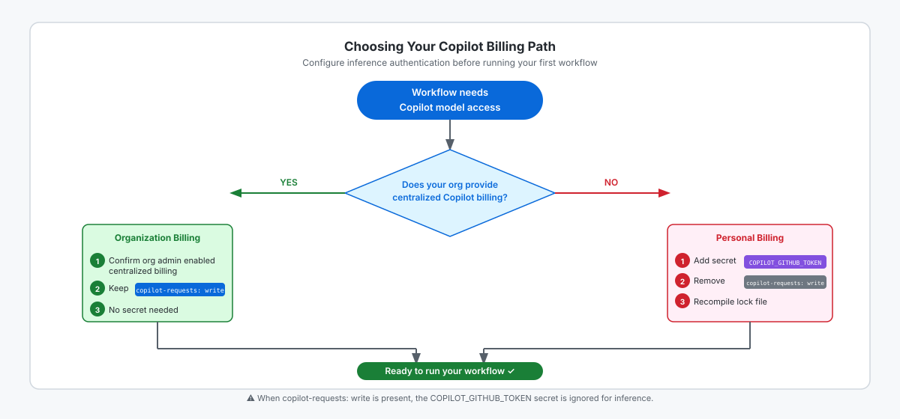

<!-- page-journey: all -->
<!-- page-adventure: core -->
# Confirm Model Access

## 📋 Before You Start

- `daily-report-status.md` and `daily-report-status.lock.yml` are committed to your practice repository.

## 🎯 What You'll Do

You'll verify Copilot model access with a quick test, then choose the [billing](https://github.github.com/gh-aw/reference/billing/) and authentication method for the first workflow, configure it, and confirm the source and lock files agree before you continue to [Step 8](08-run-your-workflow.md).

## Verify model access with a test prompt

Before configuring billing, confirm Copilot is reachable from this repository.
Catching an access problem here saves debugging time in the billing steps and in Step 8.

1. Open the **Agents** tab in your repository on GitHub.com.
2. Send the following prompt:

   ```
   What is GitHub Actions? Reply in one sentence.
   ```

3. Confirm you receive a reply. Any response means the model is accessible.
4. If you see an error, check [github.com/settings/copilot](https://github.com/settings/copilot) to confirm Copilot is enabled on your account, then return here.

> [!IMPORTANT]
> Do not continue if you received an error instead of a response. Fix the access issue now — model-access errors will cause Step 8 to fail and are much harder to diagnose mid-run. Check [github.com/settings/copilot](https://github.com/settings/copilot) first, then see [Side Quest: Configure GitHub Copilot for Agentic Workflows](side-quest-06-03-copilot-token.md) if the problem persists.

## Confirm the workflow engine

Open `.github/workflows/daily-report-status.md`. The Step 7 workflow has no `engine:` line, so it uses GitHub Copilot.

Claude and Codex are optional [engines](https://github.github.com/gh-aw/reference/engines/) introduced in later side quests. You do not need an Anthropic or OpenAI API key for this first run.

If you are working in Claude Code or OpenAI Codex, keep this first workflow on Copilot and switch later if you want:

- **Claude Code:** use [Side Quest: Configure an Anthropic API Key](side-quest-11-06-anthropic-key.md).
- **OpenAI Codex:** use [Side Quest: Configure an OpenAI API Key](side-quest-11-07-openai-key.md).

## Choose one Copilot billing path

Choose exactly one method. The diagram below shows both paths and the key configuration difference between them.

<picture>
   <source media="(prefers-color-scheme: dark)" srcset="images/07d-billing-path-decision-dark.svg">
   <source media="(prefers-color-scheme: light)" srcset="images/07d-billing-path-decision-light.svg">
   
</picture>

### Organization with centralized Copilot billing

Use this path when the organization that owns the repository has centralized Copilot billing enabled for Actions.

1. Ask your organization administrator to confirm centralized billing is enabled.
2. Open `daily-report-status.md` and confirm the `permissions:` block includes `copilot-requests: write`:

   ```yaml
   permissions:
     contents: read
     copilot-requests: write
   ```

   This line is already present in the workflow template. Do not remove it.
3. No repository secret is needed for this path.
4. Recompile and commit the lock file so it reflects the confirmed configuration:

   **If you are using a terminal:**

   ```bash
   gh aw compile
   git add .github/workflows/daily-report-status.md .github/workflows/daily-report-status.lock.yml
   git commit -m "chore: confirm lock file is current" && git push
   ```

   **If you are using the browser only:**

   In the Copilot or Agents tab, ask the agent:

   ```
   Run gh aw compile and commit the updated .github/workflows/daily-report-status.lock.yml to main.
   ```

The workflow uses the organization subscription. If you see `401 Unauthorized` in the run log, see [Method 1: Copilot Requests Permission](side-quest-06-03a-copilot-requests-permission.md) for troubleshooting.

### Personal billing

Use this path for a personal repository, or when the owning organization does not provide centralized Copilot billing.

> [!IMPORTANT]
> When `copilot-requests: write` is present, the workflow ignores `COPILOT_GITHUB_TOKEN` for inference. Remove the permission before you set up the secret, then recompile.

**If you are using a terminal:**

1. Remove `copilot-requests: write` from `daily-report-status.md`.
2. Run:

   ```bash
   gh aw secrets bootstrap --engine copilot
   ```

   This guided flow checks whether `COPILOT_GITHUB_TOKEN` is needed, prompts for it if missing, and stores it as a repository secret.
3. Recompile and commit `daily-report-status.lock.yml`.

**If you are using the browser only:**

1. In the Copilot or Agents tab, ask the agent to remove the permission line and commit the change:

   ```
   Remove the copilot-requests: write line from .github/workflows/daily-report-status.md and commit the change to main.
   ```

2. Generate a fine-grained Personal Access Token (PAT):
   - Go to [github.com/settings/tokens](https://github.com/settings/tokens) → **Generate new token (fine-grained)**.
   - Name it `gh-aw-copilot`, set an expiry (90 days is a common choice), and note the date for rotation.
   - Under **Permissions → Account permissions**, set **Copilot requests** to **Read-only**.
   - Click **Generate token** and **copy the value immediately** — GitHub shows it only once.

3. Store the PAT as a repository secret:
   - In your repository, go to **Settings → Secrets and variables → Actions**.
   - Click **New repository secret**.
   - Name: `COPILOT_GITHUB_TOKEN` (uppercase, underscores — no spaces).
   - Paste the token value and click **Add secret**.
   - Confirm the secret appears in the list before closing the token tab.

4. Ask the agent to recompile and commit the lock file:

   ```
   Run gh aw compile and commit the updated .github/workflows/daily-report-status.lock.yml to main.
   ```

For the full manual PAT procedure with detailed troubleshooting, see [Method PAT: `COPILOT_GITHUB_TOKEN`](side-quest-06-03b-copilot-github-token.md).

## Check the final configuration

Open `daily-report-status.md` and confirm it matches the method you selected:

| Billing path | `copilot-requests: write` | Required secret |
|---|---|---|
| Organization centralized billing | Present | None |
| Personal billing | Removed | `COPILOT_GITHUB_TOKEN` |

## ✅ Checkpoint

- [ ] I opened the Agents tab and sent a test prompt
- [ ] I received a response from the model
- [ ] I confirmed no access errors appeared
- [ ] I confirmed the first workflow uses GitHub Copilot
- [ ] I chose organization centralized billing or personal billing
- [ ] I completed all configuration steps for my chosen billing path (inline above — no side-quest visit required)
- [ ] My source and compiled lock file use the selected method
- [ ] Both workflow files are committed to `main`
- [ ] I am ready for [Run and Watch Your Workflow](08-run-your-workflow.md)

<!-- journey: all -->
**Next:** [Run and Watch Your Workflow](08-run-your-workflow.md)
<!-- /journey -->
